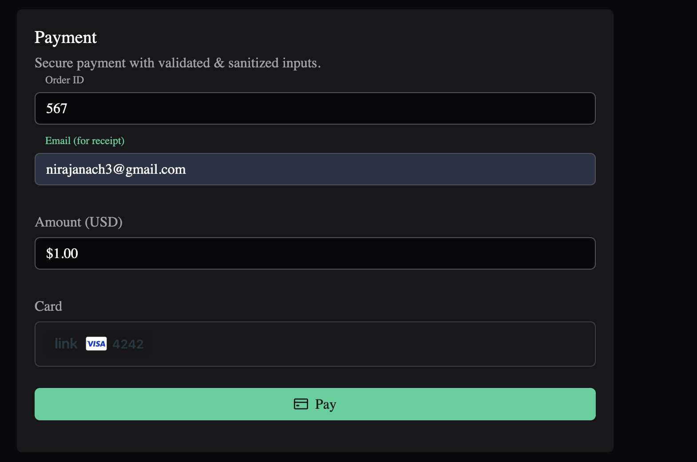
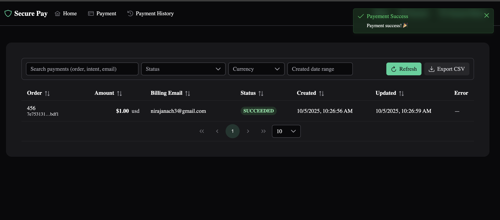

# Secure Payment — Spring Boot + Vue 3 + Stripe + PostgreSQL

A small, production‑minded sample app that demonstrates **secure, validated payments** with a hardened frontend and backend.  
It uses **Spring Boot 3** (Java 21), **Vue 3 + Vite** (PrimeVue UI), **Stripe Payment Intents**, and **PostgreSQL**. The app ships
with **Docker** and **Docker Compose** for one‑command local runs.

> This project is intentionally focused on security: strict input validation/sanitization, a strong Content Security Policy (CSP), safe database access to prevent SQL injection, and secure payment flows with Stripe Elements.

---

## Demo

| Fill & submit payment | Success toast |
|---|---|
|  |  |

---

## What the app does

- Serves a minimal UI to collect an **Order ID**, **email (for receipt)**, **amount**, and **card details** via **Stripe Elements**.
- Creates a **Stripe Payment Intent** on the server and confirms it client‑side using the returned `clientSecret`.
- Persists each attempt in PostgreSQL with status updates: **PENDING → SUCCEEDED/FAILED**.
- Shows clean, accessible UI components and success/error toasts.

---

## Security hardening — overview

### 1) Preventing SQL Injection
- **ORM with parameterized queries:** Uses Spring Data **JPA** repositories (`PaymentRepository`) instead of hand‑rolled SQL. Methods like `findByPaymentIntentId(...)` are compiled to prepared statements, so user input is **never concatenated into SQL**.
- **Validated DTOs:** Requests are bound to `CreatePaymentRequest` / `ConfirmPaymentRequest` records annotated with `@NotNull`, `@Min`, `@NotBlank`, and `@Email`. Controllers are annotated with `@Validated`, rejecting bad input before it reaches the database.
- **Typed schema with length caps:** Entity columns (e.g., `order_id`, `billing_email`, `status`, `last_error`) have sensible lengths and types, limiting injection surface and stored payload size.

### 2) Preventing Cross‑Site Scripting (XSS)
- **Strict Content Security Policy (CSP):** A servlet filter sets a tight CSP that **disallows inline/eval scripts**, allows scripts only from the app itself and **Stripe’s domains**, restricts `connect-src` to your API/Stripe, sets `frame-src` to Stripe only, and blocks dangerous features (e.g., `object-src 'none'`, `base-uri 'none'`, `frame-ancestors 'none'`). This dramatically reduces the blast radius of any markup injection.
- **Security headers:** Spring Security config adds headers such as **X‑Content‑Type‑Options: nosniff**, **X‑Frame‑Options: DENY**, **X‑XSS‑Protection: 1; mode=block**, **Referrer‑Policy: no-referrer**, and a conservative **Permissions‑Policy**.
- **Frontend sanitization:** Any free‑text input is sanitized with **DOMPurify** (`useSanitize.js`) and validated on the client before submit. Vue’s template escaping further protects rendered content.
- **Server‑side validation:** Even if a malicious user bypasses the UI, the backend validates and normalizes fields, returning structured errors without reflecting attacker‑controlled HTML back to the page.
- **HTTPS ready:** The app is configured with a keystore for TLS so traffic (including Stripe interactions) can run over HTTPS in local/test environments.

---

## Tech stack

**Backend**
- Java **21**, Spring Boot **3.3**
- Spring MVC, Spring Security, Jakarta Validation
- Stripe Java SDK
- Spring Data JPA (Hibernate) with PostgreSQL

**Frontend**
- Vue **3** + Vite
- PrimeVue / PrimeFlex (dark theme)
- Stripe.js (Elements)
- DOMPurify for sanitization

**Database**
- PostgreSQL **16** (entity: `payments` with UUID primary key, orderId, amount, currency, email, status, timestamps)

**Containerization**
- Multi‑stage **Dockerfile** builds a bootable JAR
- **docker-compose.yml** runs **PostgreSQL** + the app

---

## How to run

### Docker Compose (recommended)
1. Create a `.env` file next to `docker-compose.yml` with your Stripe keys:
   ```bash
   STRIPE_PUBLISHABLE_KEY=pk_test_...
   STRIPE_SECRET_KEY=sk_test_...
   STRIPE_WEBHOOK_SECRET=whsec_...   # optional for webhooks
   ```
2. Build and start:
   ```bash
   docker compose up --build
   ```
3. Open the app:
   - UI & API: **https://localhost:8080** 
   - DB: exposed on **5432** for local tooling


## Stripe integration (flow)

1. **Client** requests `/api/config` to load the publishable key.
2. **Client** posts to `/api/payments/create-intent` with `{ orderId, amountCents, currency, email }`.
3. **Server** creates a Stripe **Payment Intent**, stores a `payments` record, and returns the `clientSecret`.
4. **Client** confirms the payment using **Stripe Elements** (no card data touches your server).
5. **Client** posts the outcome to `/api/payments/record-result` so the server updates status (**SUCCEEDED/FAILED/PENDING**).
---

## Configuration

Key environment variables (with sane defaults):
- `DB_URL`, `DB_USERNAME`, `DB_PASSWORD`
- `STRIPE_PUBLISHABLE_KEY`, `STRIPE_SECRET_KEY`, `STRIPE_WEBHOOK_SECRET` (optional)
- Server TLS settings are provided in `application.yml` (keystore path, alias, password).

---

## Repository layout (high level)

```
src/
  main/java/com/example/payments/
    config/            # Spring Security + CSP filter
    controller/        # /api/config, /api/payments endpoints
    dto/               # Validated request records
    model/             # JPA entity (Payment)
    repo/              # Spring Data JPA repository
  main/resources/
    application.yml    # DB, Stripe, TLS config
    static/            # Built Vue app served by Spring Boot
  client/              # Vue 3 + Vite SPA source (PrimeVue, Stripe.js, DOMPurify)
Dockerfile
docker-compose.yml
pom.xml
```

---
